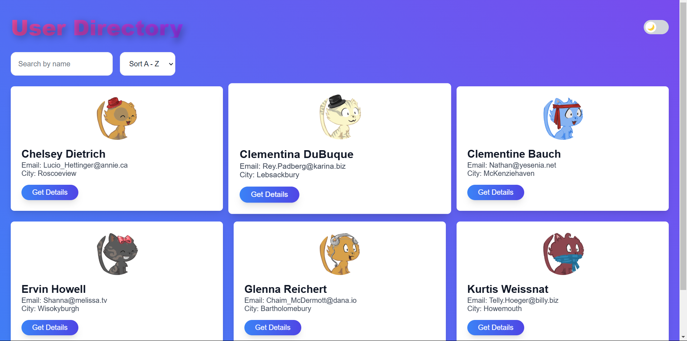
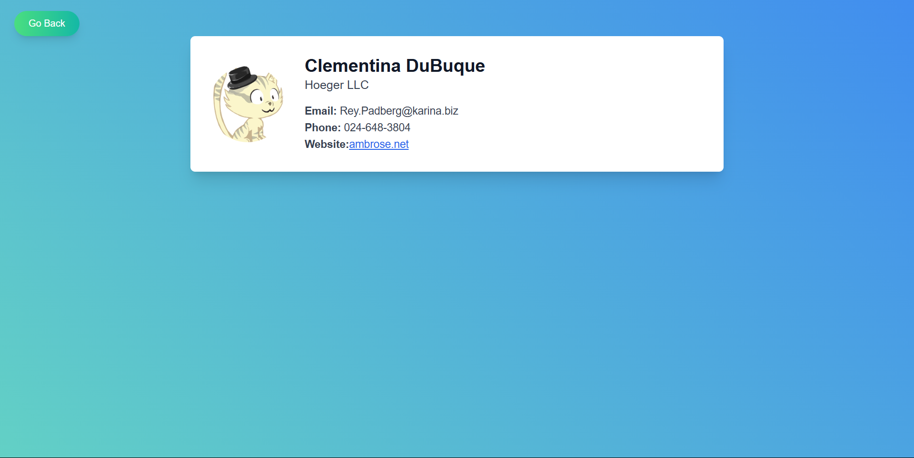
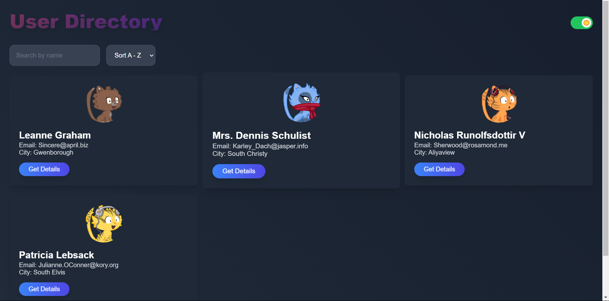
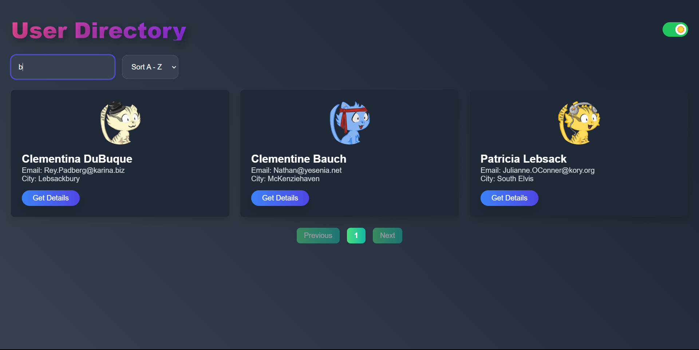
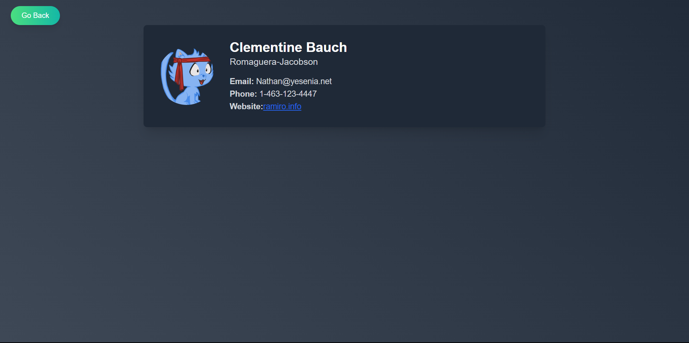

# User Directory

A simple React application for displaying user data with features such as search, sort, pagination, and dark/light mode toggle.

## Features
- **Search**: Search users by name.
- **Sort**: Sort users in ascending or descending order.
- **Pagination**: Displays 6 users per page with page navigation.
- **Dark/Light Mode**: Toggle between dark and light mode.
- **Responsive Design**: Optimized for mobile and desktop views.

## Prerequisites

Before you begin, ensure you have the following installed on your machine:

- **Node.js**: [Download and Install Node.js](https://nodejs.org/)
- **npm**: npm is installed automatically with Node.js.

## Installation and Setup

Follow these steps to download and run the project locally:

### 1. Clone the repository
First, clone the repository to your local machine using the following command:

```bash
git clone https://github.com/SudarshanaRao/user-directory.git
```

### 2. Navigate to the project folder
Move to the project directory:

```bash
cd user-directory
```

### 3. Install dependencies
Run the following command to install the required dependencies:

```bash
npm install
```

This will install all the necessary libraries and packages required for the application.

### 4. Run the project
After the dependencies are installed, you can start the application by running:

```bash
npm start
```

This will start the development server, and you can view the project in your browser at:

```
http://localhost:3000
```

## Available Scripts
In the project directory, you can run the following commands:

```bash
npm start
```
Runs the app in development mode. Open [http://localhost:3000](http://localhost:3000) to view it in the browser.

```bash
npm run build
```
Builds the app for production to the `build` folder. It correctly bundles the React app in production mode and optimizes the build for the best performance.

```bash
npm test
```
Launches the test runner in the interactive watch mode.

```bash
npm run eject
```
This command will remove the single build dependency from your project. **Note:** This is a one-way operation and cannot be reversed.

## Contributing
Contributions are welcome! Feel free to fork the repository, make your changes, and submit a pull request.

## Screenshots

### LIGHT MODE 




### DARK MODE






